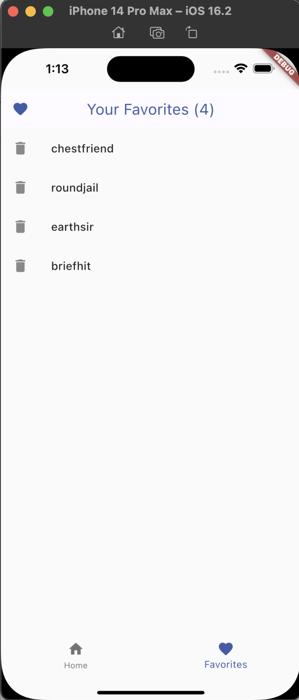

# flutter-responsive
Just doing the second first Flutter app from https://flutter.dev/learn

Here's the lab:

https://codelabs.developers.google.com/codelabs/flutter-codelab-first#5

but optimized for iPhone instead of a web page - therefor using the `Scaffold` Widget's `bottomNavigationBar` instead of the proposed `NavigationRail`:

